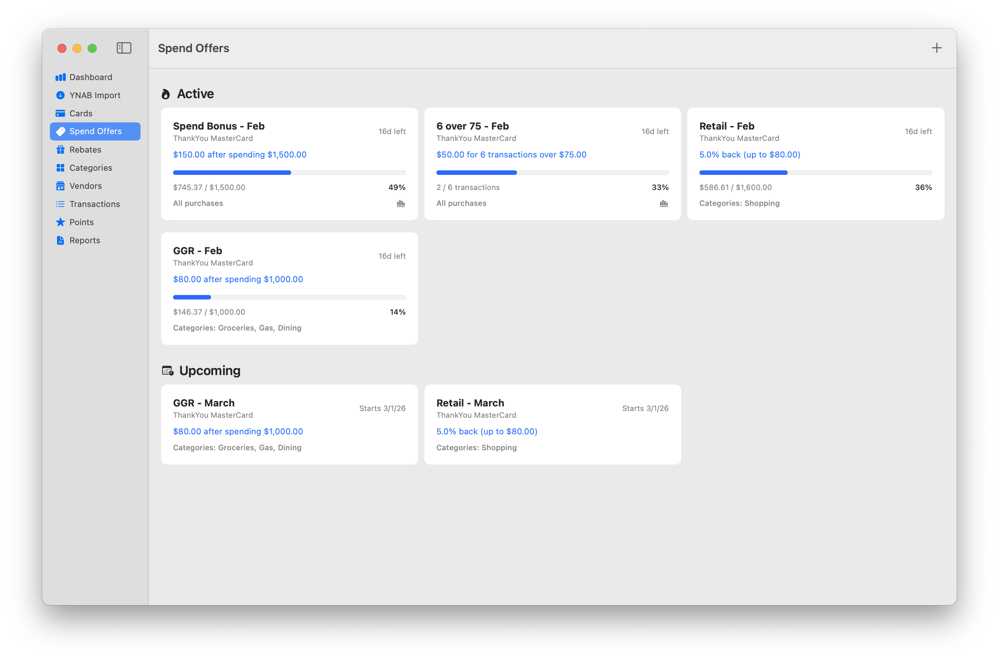

# Sublimate

A Mac app for managing and optimizing credit card rewards.

## Warning

This is a Swift app built by a web developer. This project is my way of learning Swift, and it's almost entirely vibe coded. Use at your own risk. Stupidity abounds in this codebase.

## Features

- **Card Management** - Track credit cards and their points earning rates across different categories
- **Points Cap Tracking** - Track capped categories so you know when to direct spend to different cards
- **Spending Offers** - Monitor and track spending offers and sign-up bonuses
- **Rebate Tracking** - Keep tabs on rebate offers from various vendors
- **Dashboard** - Get at-a-glance metrics, progress on spend offers, and optimization suggestions
- **Cash Back Reporting** - Analyze cash back rates by card, spending category, and vendor
- **YNAB Integration** - Import transactions directly from You Need A Budget

## Limitations

- **Transactions can only be entered manually or imported from YNAB** - Currently, Sublimate's design assumes you are already a YNAB user. Transaction import isn't supported via any other method besides manual entry.
- **No recurring spend offers** - If you have a card that has monthly spending bonuses, you need to create the Spend Offers for each month - there is no way to make them recur automatically.
- **Categories apply to all cards** - Sublimate does not support card-level categories. This means that you need to design your categories in such a way that they'll work with the rule structure for all your cards. For example, if you have a card that offers 5% cashback on clothing shops, and another card that offers 5% cashback on all retail, you'll need to create separate Clothing and Retail categories, and make the rule on your 5% retail cashback card apply to both Clothing and Retail.

## Building

Currently must be built from source using Xcode.

## Contributing

Bug reports, suggestions, and PRs are welcome via GitHub issues.

## License

This project is licensed under the Creative Commons Attribution-NonCommercial 4.0 International License (CC BY-NC 4.0).

You are free to:

- Use this software for personal purposes
- Modify the code for your personal use
- Share the software with others

Under the following terms:

- Attribution: You must give appropriate credit
- NonCommercial: You may not use the material for commercial purposes or sell derivative works

See the LICENSE file for full details, or visit https://creativecommons.org/licenses/by-nc/4.0/
